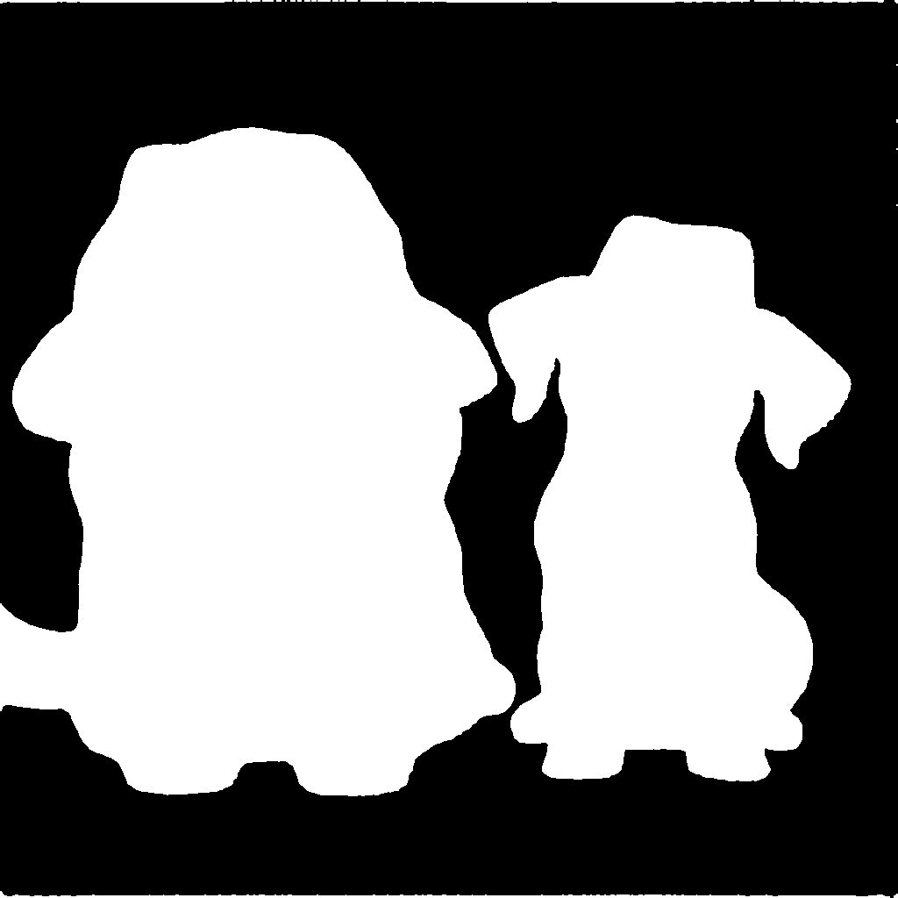
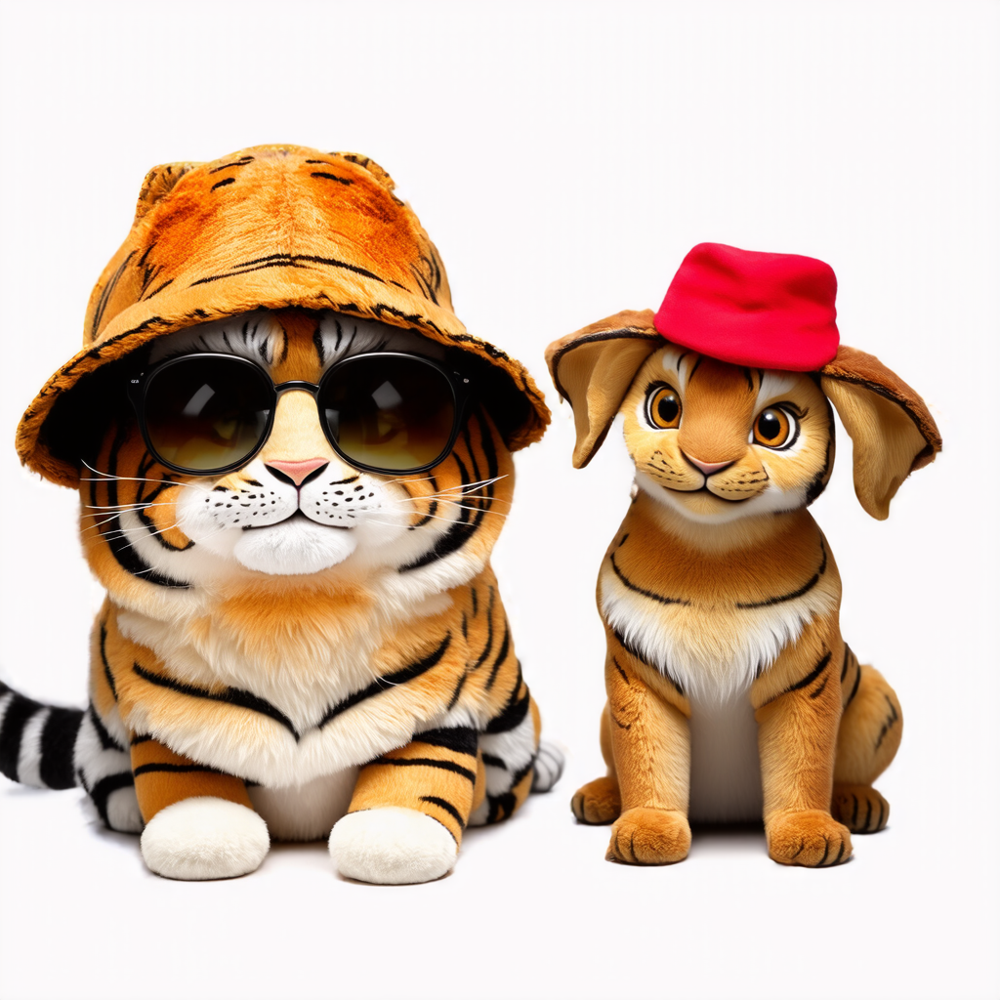

# Welcome to the 3-phase-image-generating and inpainting

## Text to Image ([Demo](Code/T2I.py))
We can use the following prompt to create an image:
```
A cat wearing a sunglasses and a dog wearing a hat
```
Then we may attain the generated image


## Mask Generation ([Demo](Code/MaskGen.py))


## Inpainting ([Demo](Code/Inpaint.py))
Positive prompt for inpainting:
```
A Tiger and a rabbit
```



